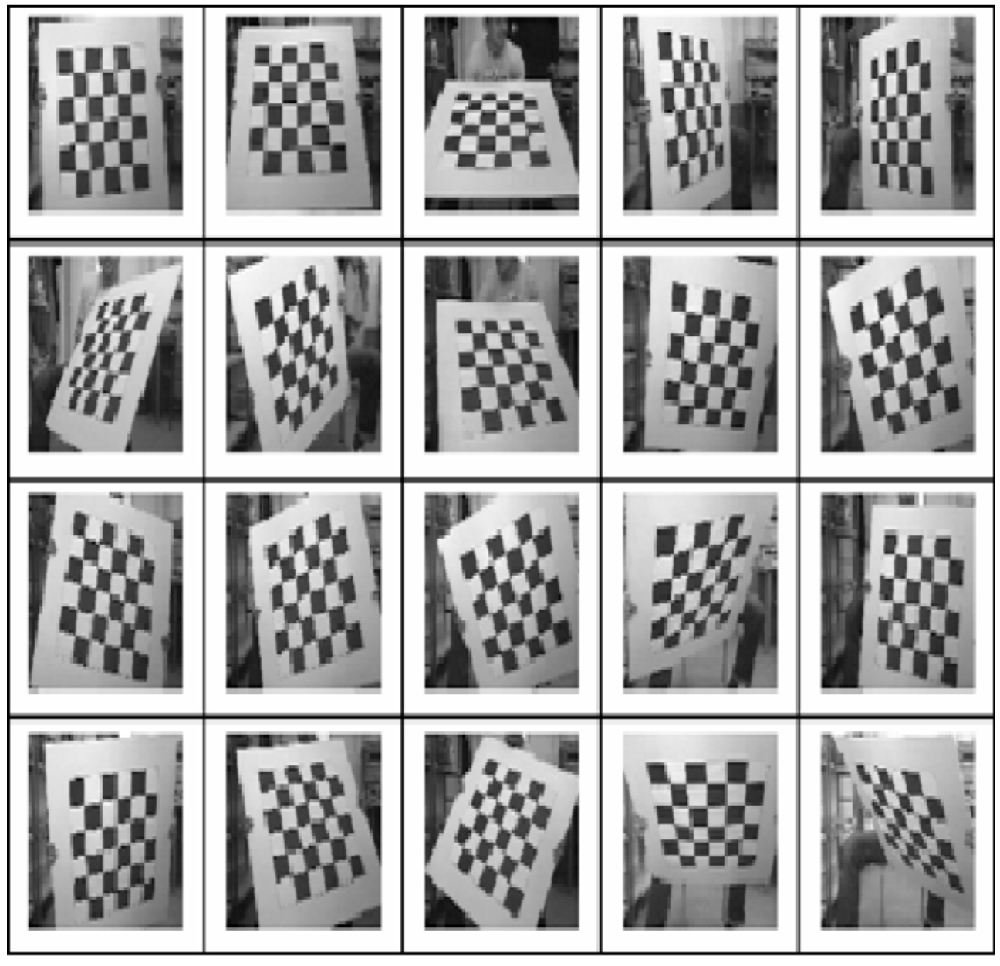

# Lens Distortion Correction 

## 1. Prepare 
```bash
pip install opencv-python
```

print Checkboard-A4-30mm-8x6.pdf file 

## 2. Run

### 1. Capture for calculate calibration parameter
```bash
python 0_capture.py [camera number]
```
Put the camera number in the camera number column

Example
```bash
python 0_capture.py 0
```

The command proceeds to capture the camera.
Set all the printed checkboards to fit into the camera and press the keyboard 's' to proceed with the capture.
You need to capture the checkboard from various angles as shown in the picture below.
Press the 'esc' button to stop capture.

The images taken are stored in the cam_[camera number] folder.



### 2. Calculate parameter for lens distortion correction
```bash
python 1_calculate.py [camera number]
```
When you execute the above command, the calibration calculated value is saved as dewarper_config.txt.


### 3. image show distortion correction 
```bash
python 2_dewarp.py [camera number] [save_file_path]
```
Example 
```bash
python 2_dewarp.py 0 cam_0_Dewarp.mp4
```

If you don't want to save it as a file and just want to see the video, empty the save file 

Example 
```bash
python 2_dewarp.py 0
```

The lens distortion correction image is displayed and saved 

### 4. image show default 
```bash
python 3_derault.py [camera number] [save_file_path]
```
Display the default image that has not been calibrated and save file 

